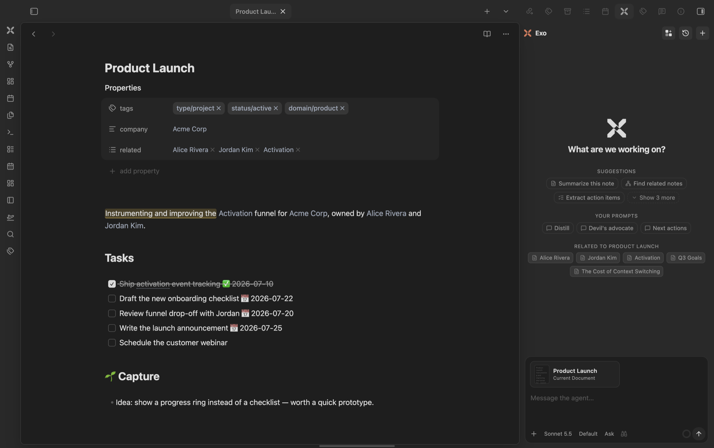
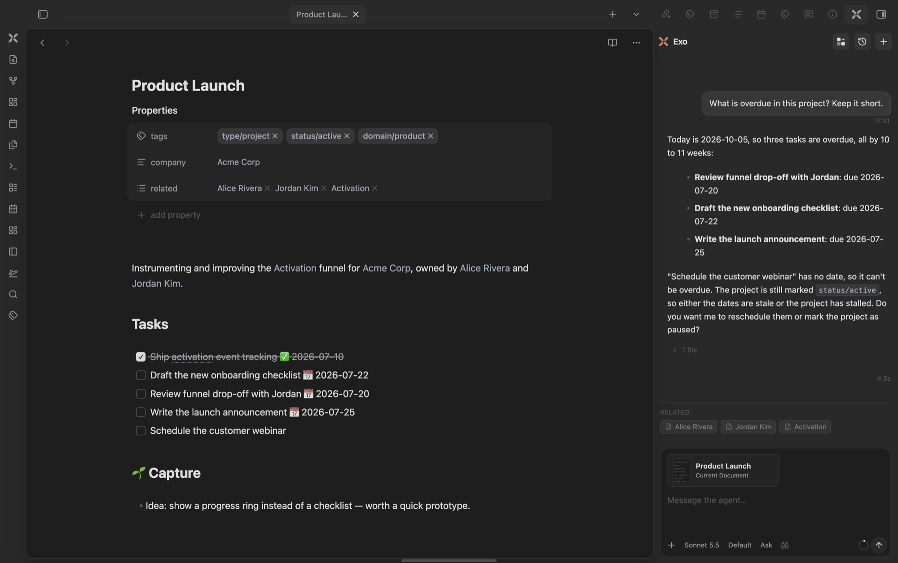
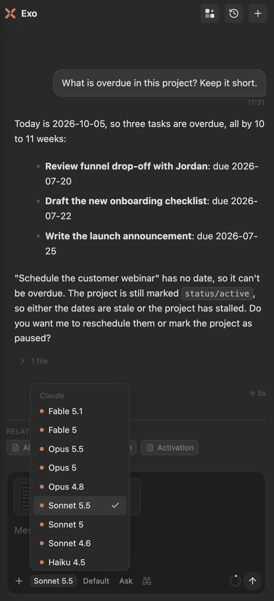
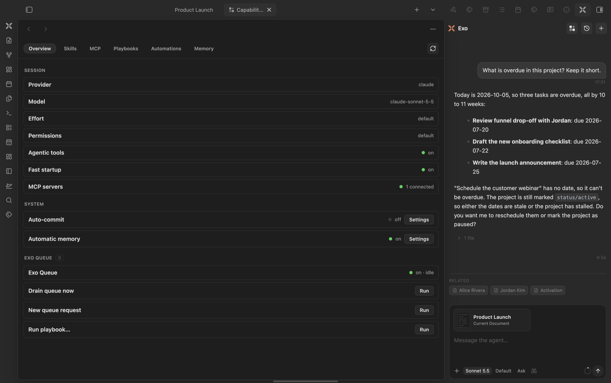

<p align="center">
  
</p>

# Exo Agent

An agentic AI assistant in your Obsidian sidebar, powered by the **Claude CLI** or the **Codex CLI** you already use. Your vault is the agent's working directory: it reads, links and writes your notes from a theme-aware chat, no terminal needed.

## Screenshots

<p align="center">
  
</p>
<p align="center"><em>Exo in the sidebar, next to the note you are working on: suggestions, your saved prompts, and notes related to the open one.</em></p>

<p align="center">
  
</p>
<p align="center"><em>Ask about the open note: Exo reads it and answers with the overdue tasks, linking the file it touched.</em></p>

<p align="center">
  
</p>
<p align="center"><em>Model, effort, and permission sit in the composer, one click away.</em></p>

<p align="center">
  
</p>
<p align="center"><em>The Capabilities hub: session state, skills, MCP servers, playbooks, automations, and memory in one place.</em></p>

## Features

**Chat**
- **Claude or Codex, per chat.** Claude runs through the Claude Agent SDK on your installed CLI; Codex through a persistent `codex app-server` thread. Pick any model from the composer: the choice belongs to that chat, and new chats start from the defaults in settings. Choose which models the picker lists in Settings, *Models in the composer*.
- **Agentic, with permission gating.** The agent can read, write, edit, search and run shell commands in your vault. Every tool call is a card; sensitive ones ask **Allow once / Always allow / Deny**. Edits show a diff, shell calls show command and output.
- **Context that follows the screen.** The note you are looking at rides along with your message as a *Current Document* card. Behind a full-page chat it is only offered (click to attach), so a note you can't see is never sent by surprise. Add more with `@` or the `+` menu (notes, files, folders, images).
- **Composer.** `/` opens your prompts plus the vault's `.claude/` commands and skills; messages typed while the agent works are queued. Effort and permission mode sit next to the model.
- **Persistent sessions.** Conversations survive reloads and resume their CLI session; Claude keeps one warm process across turns. Live context-window usage, streamed reasoning, parallel chats, and a history gallery.

**Obsidian-native** (all toggleable in settings)
- **Vault tools**: `search_vault`, `read_note`, `get_backlinks`, `get_neighborhood`, `list_notes`, `list_tags`, `get_active_context`, `create_note`, `append_to_note`, `update_frontmatter`, `add_links`, `open_note`. `search_vault` uses the [Sonar](https://github.com/mariomile/obsidian-sonar) index when installed. Codex reaches the same tools through a local MCP bridge.
- **Touched notes**: after each turn, a footer lists what the agent edited (with diff and revert) and read. Replies link the notes they mention.
- **Memory**: your vault is Exo's memory. See [Memory](#memory).
- **Capabilities hub**: skills, MCP servers, playbooks, automations and memory in one pane, also callable by the agent.
- **Named agents** *(off by default)*: your `.claude/agents/*.md` become teammates. `@agent` routes one turn, `/as <agent>` binds the chat. Each agent has a contract (triggers, autonomy tier `notify`/`propose`/`act`, read/write globs); unattended runs are checkpointed and logged. On Claude a bound agent is an isolated subagent; on Codex it hands the turn the agent's instructions, with no isolation. See `docs/specs/2026-08-01-agents-design.md`.

## Requirements

- **Desktop Obsidian only** (`isDesktopOnly`): Exo spawns the local `claude`/`codex` CLI with Node's `child_process`, which mobile doesn't have.
- The `claude` and/or `codex` CLI installed and signed in. Paths are detected automatically; override them in settings.
- Optional: [Sonar](https://github.com/mariomile/obsidian-sonar) for better vault search.

## Install

In Obsidian, open **Settings → Community plugins → Browse**, search for **Exo Agent**, install and enable it. Open it from the ribbon or with *Exo Agent: Open chat*.

Manual install: copy `main.js`, `manifest.json` and `styles.css` from the [latest release](https://github.com/mariomile/obsidian-exo-agent/releases/latest) into `<vault>/.obsidian/plugins/exo-agent/`.

To try it without touching your vault, use the [Obsidianverse sample vault](https://github.com/mariomile/obsidianverse-sample-vault), a small fictional vault with the whole plugin suite set up.

## Privacy & Security

**Network.** Exo sends no telemetry and never contacts its author. Model traffic comes from the `claude` or `codex` CLI on your machine, using **your own login or API key**: `claude` talks to Anthropic, `codex` to OpenAI. Exo itself makes two kinds of request, both via Obsidian's `requestUrl`:
- **CLI update check**: at most once a day, a GET to `https://registry.npmjs.org/@anthropic-ai/claude-code/latest` for the latest version number. Nothing about you or your vault is sent.
- **Exo Collabo** (opt-in, off until you set a service URL and API key): the note you choose to share goes to the service URL *you* configured.

**What leaves your machine.** Your message plus the context Exo attaches (the visible note, `@`-mentioned files, tool results and, with the Obsidian-native layer on, your memory folder) goes to the CLI, which forwards it to Anthropic or OpenAI within your own account. Nothing reaches the Exo author.

**What the agent can do.** The CLI runs with your vault as its working directory, so the agent can read, write and edit vault files and run shell commands. On Claude, each tool call passes through Exo's permission cards (per-session allowlist; only read-only tools can be auto-allowed). On Codex, its sandbox plus command/file approvals are routed through the same UI.

**Capabilities outside the Obsidian API**, and why:
- **Shell (`child_process`)**: spawning the CLIs is the plugin. It also runs `node --version` / `<cli> --version` to find them, `npm install -g @anthropic-ai/claude-code` or `claude update` when you click *Update now*, `claude mcp login/logout` from the Connections pane, and `node chat-recall.mjs` for the optional semantic chat search.
- **Filesystem outside the vault (`fs`)**: resolves CLI install locations; reads `~/.claude/` (skills, agents, MCP config, transcripts) for the hub and resume checks, and deletes a chat's transcript there only when you free that chat; writes two helper scripts (`codex-bridge.mjs`, `chat-recall.mjs`) into the plugin folder.
- **Environment**: the CLIs inherit your environment with an augmented `PATH` (GUI apps don't get your shell's `PATH`); `$SHELL` helps locate them. Nothing is read to identify you.
- **Vault enumeration**: `@`-mentions, the daily pulse, agent triggers and the vault tools list files locally; content leaves only when a prompt sends it to your provider.
- **Clipboard**: *Copy* buttons write to it; *Import a document from Collabo* reads a share link from it, only when you run that command.
- **Dynamic code (`new Function`)**: not Exo's. A one-line feature probe in the zod validator bundled inside the Claude Agent SDK.

## Memory

Exo keeps no memory store of its own: everything it remembers is a line in a Markdown note you own. Automatic memory is on by default (Settings → Memory → *Automatic memory*).

**Setup.** Exo's own files live in a configurable **memory folder**: `_exo/` on a fresh vault, or your existing `_system/`. The first new chat offers a one-time choice: *Full memory* (operational layer plus a starter: vault-context, preferences, identity blocks you can fill in or draft with *Exo Agent: Seed agent folder*), *Just the essentials* (only what Exo's features need), or *Not now*. *Exo Agent: Set up vault memory* re-applies the scaffold at any time; it only adds what is missing and never imposes a folder scheme on your notes.

**What it remembers.** When a chat goes idle (about ten minutes, or when you switch away or close it), Exo extracts the facts worth keeping: your preferences and ways of working, facts about people, companies and projects, and lessons for the agent. Task chatter, one-off instructions and anything that looks like a secret are skipped. Chats pending when Obsidian closed are caught up on the next start.

**Where it writes.** For each fact Exo searches the vault, reads the note it would touch, and either appends one bullet to an **existing** note or replaces **one existing line**, keeping the old value as a trace (`Head of design (since 2026-09-25; previously designer)`). A `## Memory` section in your `AGENTS.md` sets the routing. At most 8 lines per chat; facts with no home go to `<memory folder>/memory/inbox/YYYY-MM-DD.md`. It never creates other notes and never touches frontmatter, headings, tables, code blocks, hidden folders, `Input/` or Readwise imports, Obsidian's *Excluded files*, `AGENTS.md`/`CLAUDE.md`, or Exo's own files.

**Recall.** Before each message Exo searches the vault and your last 60 days of chats and adds the best matches as background; a *Recalled N* row shows exactly what. The agent can also read recent chats with the `recent_chats` tool.

**Undo.** Each harvest shows a notice, and the hub's Memory tab lists every write with an **Undo** button. In a git vault each harvest is one commit touching only those notes, and undo is a `git revert` (refused if you changed the notes since); notes with your own uncommitted edits are written but left out of the commit. Without git, undo removes exactly the lines Exo added. You can also run *Exo Agent: Undo last memory write* or ask Exo.

**Cost.** Harvesting uses the background model within a daily budget (Settings → Memory → *Background AI*). Turn off *Automatic memory* to stop harvesting and recall, or *Write vault memory* to stop every write.

## Develop

```bash
pnpm install
pnpm dev      # watch + auto-deploy (see .obsidian-plugin-dir)
pnpm build    # typecheck + production bundle
pnpm test     # vitest
```

Put the absolute path of your vault's `.obsidian/plugins/exo-agent` folder in a `.obsidian-plugin-dir` file to deploy on every build. Release steps: `docs/release-checklist.md`.

**Layout.** `src/main.ts` is the plugin entry; `src/view.ts` the chat view; `src/ui/` its components (composer, tool cards, the Capabilities hub in `src/ui/hub/`); `src/providers/` the Claude and Codex adapters, normalized into one `AgentEvent` stream; `src/obsidian/` vault tools, memory and agents; `src/core/` pure, unit-tested logic.

## License

MIT
